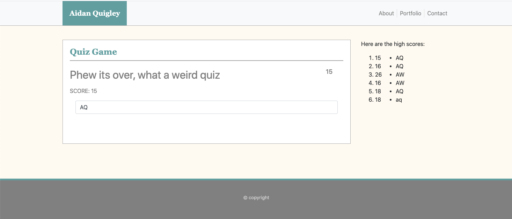

# 04 Web APIs: Code Quiz

The goal of this assignment was to create a quiz game that was multiple choice and gave a score at the end. That score would be saved to local storage and so people taking the quiz on the same machine could see the scores. This app was intented to run in the browser and feature dynamically updated HTML and CSS which would be modified by the javascript file. the web layout needed to be clean and responseive to multiple screen sizes. Included below is an image sampling the quiz game

